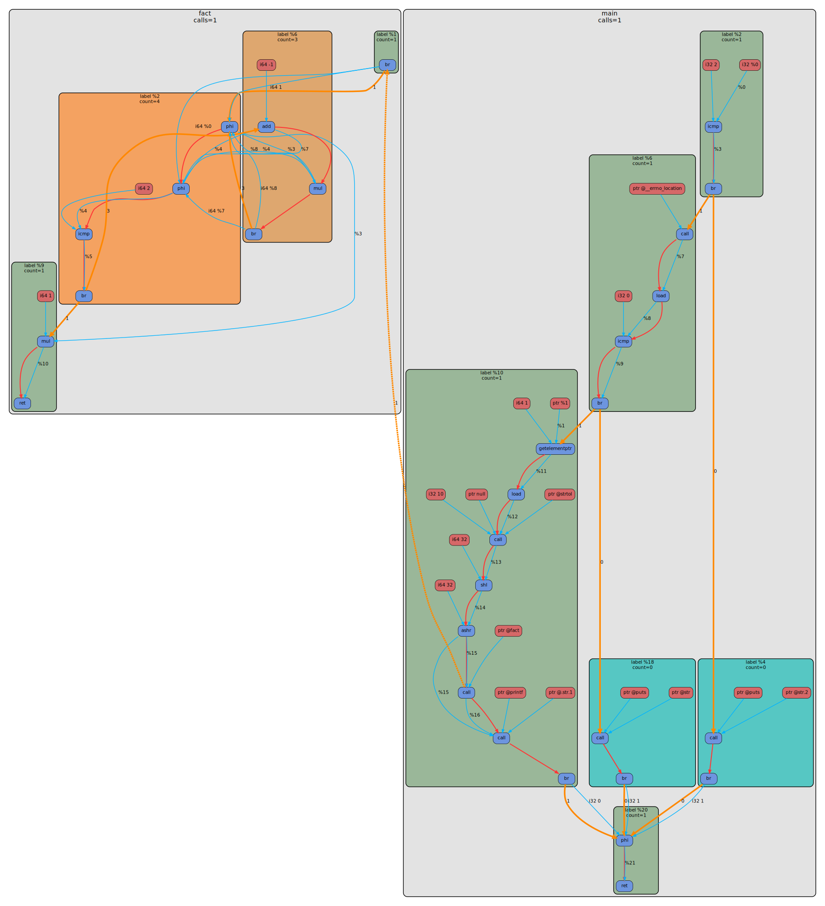

# LLVM IR Dumper

`LLVM IR Dumper` это LLVM pass plugin и набор утилит вокруг него для получения статического и динамического CFG/DFG графа программы.

Сейчас архитектура разделена так:

- `libLLVMIRDumper.so` строит `IrGraph`, сериализует его в JSON и при необходимости инжектит runtime logging
- `ir_graph_to_dot` переводит `IrGraph JSON -> DOT`
- `ir_graph_profile_merge` мержит статический JSON и runtime log
- `graphcc` это Python driver компиляторного типа, который оркестрирует весь pipeline

Главная идея: на C++ остаются только необходимые этапы, а общий driver живёт в Python.

## Что умеет проект

- снимать два статических среза LLVM IR: `before_opt` и `after_opt`
- строить по ним промежуточное представление `IrGraph`
- сериализовать `IrGraph` в JSON через `to_json/from_json`
- рендерить JSON в `.dot`
- инжектить runtime logging в бинарник
- собирать dynamic profile из `[ir-log]` событий
- мержить dynamic profile обратно в `IrGraph`
- рисовать SVG, где часто посещаемые basic blocks теплее по цвету

## Пайплайн

### Static

1. `clang/clang++` загружает `libLLVMIRDumper.so`
2. pass снимает `before_opt` и `after_opt` snapshot'ы
3. каждый snapshot сериализуется в `IrGraph JSON`
4. `ir_graph_to_dot` переводит JSON в DOT
5. `dot` из Graphviz рендерит SVG

### Dynamic

1. driver сначала делает базовый static build и получает `before_static.json` / `after_static.json`
2. для каждой requested dynamic stage driver собирает отдельный instrumented binary:
   - `before` с inject-pass на pipeline start
   - `after` с inject-pass на optimizer last
3. stdout программы сохраняется в `tmp/*.runtime.log`
4. `ir_graph_profile_merge` читает соответствующий static JSON и runtime log
5. merge записывает `execution_count` в функции, basic blocks и `control_flow/call` edges
6. `ir_graph_to_dot` рендерит уже dynamic JSON
7. `dot` превращает его в SVG

## Архитектура

- `ir_graph` это чистое внутреннее представление без DOT-стилей, цветов и шрифтов
- pass строит только семантический `IrGraph`
- DOT-специфичная логика вынесена в `ir_graph_to_dot`
- merge runtime profile это отдельный пост-этап поверх уже готового статического JSON
- pointer-based таблицы живут только в build-time info builder'а и не попадают в сериализуемый `IrGraph`

Из-за этого один и тот же JSON можно:

- анализировать отдельно
- мержить с runtime profile
- рендерить в разные представления

## Утилиты

После сборки устанавливаются:

- `install/lib/libLLVMIRDumper.so`
- `install/bin/ir_graph_to_dot`
- `install/bin/ir_graph_profile_merge`
- `install/bin/graphcc`

Также сохранена совместимая Python-обёртка:

- `scripts/compile_with_plugin.py`

Она просто вызывает новый `graphcc` driver.

## Требования

- `cmake`
- `clang`
- `LLVM` с CMake config
- `python3`
- `graphviz`, если нужен SVG

Подмодули:

- `3rd_party/argparse`
- `3rd_party/nlohmann`
- `3rd_party/dot-graph-lib`

Если локальный `3rd_party/nlohmann` ещё не доехал, CMake временно умеет брать fallback из `../../3rd_party/nlohmann`.

## Сборка

```bash
bash scripts/build.sh
```

Если хотите вызывать `graphcc` просто по имени из shell, а не через `install/bin/graphcc`, есть два варианта:

- поставить проект с `CMAKE_INSTALL_PREFIX` в директорию, чей `bin` уже есть в `PATH`
- включить опциональный symlink:

```bash
cmake -B build \
  -DGRAPHCC_INSTALL_SYMLINK=ON \
  -DGRAPHCC_INSTALL_SYMLINK_DIR="$HOME/.local/bin"
cmake --build build
cmake --install build --prefix install
```

Это создаст `~/.local/bin/graphcc -> <install-prefix>/bin/graphcc`.
Важно: `~/.local/bin` должен быть в `PATH`.

## Driver

Рекомендуемое имя driver'а: `graphcc`.

Базовый сценарий:

```bash
install/bin/graphcc --workdir examples/fact fact.c -o examples/fact/O1/result.svg --opt-level O1 --program-arg 5
```

Короткая модель такая же, как у компилятора:

- на вход подаётся исходник
- `-o` задаёт финальный SVG динамического графа
- `--emit-*` сохраняют промежуточные представления
- артефакты складываются в `<workdir>/<opt-level>/...`

По умолчанию driver создаёт:

- `<workdir>/<opt-level>/out`
- `<workdir>/<opt-level>/tmp`

Во время работы все промежуточные файлы живут в `tmp`.
Если указан `--emit-json`, `--emit-dot` или `--emit-ll`, нужные артефакты копируются из `tmp` в итоговые каталоги, а затем `tmp` удаляется. Для отладки можно оставить его через `--keep-tmp`.

## Layout артефактов

Для `--workdir examples/fact --opt-level O1` итоговый layout такой:

- `examples/fact/O1/out`
- `examples/fact/O1/tmp/...`
- `examples/fact/O1/llvm_ir/before_opt.ll`
- `examples/fact/O1/llvm_ir/after_opt.ll`
- `examples/fact/O1/json/before_static.json`
- `examples/fact/O1/json/after_static.json`
- `examples/fact/O1/json/before_dynamic.json`
- `examples/fact/O1/json/after_dynamic.json`
- `examples/fact/O1/dot/before_static.dot`
- `examples/fact/O1/dot/after_static.dot`
- `examples/fact/O1/dot/before_dynamic.dot`
- `examples/fact/O1/dot/after_dynamic.dot`
- `examples/fact/O1/svg/before_static.svg`
- `examples/fact/O1/svg/after_static.svg`
- `examples/fact/O1/svg/before_dynamic.svg`
- `examples/fact/O1/svg/after_dynamic.svg`

## Основные флаги `graphcc`

- `source` позиционный путь к исходнику
- `--workdir` базовая директория; output root будет `<workdir>/<opt-level>`
- `--opt-level` уровень оптимизации, например `O0`, `O1`, `O2`, `O3`
- `-o PATH` финальный SVG для `after` dynamic graph
- `--emit-static-graph` сохранить static SVG
- `--emit-dynamic-graph` сохранить dynamic SVG
- `--emit-json` сохранить JSON артефакты
- `--emit-dot` сохранить DOT артефакты
- `--emit-ll` сохранить `.ll` snapshot'ы
- `--static-stage before|after|both`
- `--dynamic-stage before|after|both`
- `--program-arg ARG` аргумент для запуска инструментированного бинарника
- `--program-args ...` альтернативный способ передать argv списком
- `--extra-clang-arg ARG` дополнительный аргумент в `clang/clang++`
- `--compiler` явно задать компилятор
- `--no-svg` не вызывать Graphviz
- `--keep-tmp` не удалять `tmp`

Замечания:

- если не указать ни `--emit-static-graph`, ни `--emit-dynamic-graph`, но указать `--emit-json`, `--emit-dot` или `--emit-ll`, driver по умолчанию считает, что нужен `after` static pipeline
- `-o` эквивалентен запросу на `after` dynamic graph
- `before` и `after` dynamic строятся отдельными instrumented build'ами

## Примеры

### 1. Финальный динамический граф

```bash
install/bin/graphcc \
  --workdir examples/fact \
  fact.c \
  --opt-level O1 \
  --program-arg 5 \
  -o examples/fact/O1/result.svg
```

### 2. Только static JSON для `before` и `after`

```bash
python3 scripts/graphcc.py \
  --workdir examples/fact \
  fact.c \
  --opt-level O1 \
  --emit-json \
  --static-stage both \
  --no-svg
```

### 3. Static SVG + JSON + DOT

```bash
python3 scripts/graphcc.py \
  --workdir examples/fact \
  fact.c \
  --opt-level O1 \
  --emit-static-graph \
  --static-stage both \
  --emit-json \
  --emit-dot
```

### 4. Dynamic JSON + DOT + SVG

```bash
python3 scripts/graphcc.py \
  --workdir examples/fact \
  fact.c \
  --opt-level O1 \
  --emit-dynamic-graph \
  --emit-json \
  --emit-dot \
  --program-arg 5
```

### 5. Both dynamic stages

```bash
python3 scripts/graphcc.py \
  --workdir examples/fact \
  fact.c \
  --opt-level O1 \
  --emit-dynamic-graph \
  --dynamic-stage both \
  --emit-json \
  --emit-dot \
  --program-arg 5 \
  --no-svg
```

### 6. Передача argv списком

```bash
python3 scripts/graphcc.py \
  --workdir examples/fact \
  fact.c \
  --opt-level O1 \
  --emit-dynamic-graph \
  --program-args 5
```

Если нужно передавать аргументы, начинающиеся с `-`, удобнее использовать повторяющийся `--program-arg`.

## Примеры визуализации

Ниже один и тот же `examples/fact/fact.c` при `-O1`.

Слева `after_static`, справа `after_dynamic` после запуска с `argv = 5`.
У dynamic graph basic blocks раскрашены по частоте посещения, функции имеют `calls=N`, а `control_flow/call` edges получают execution counts.

| Static `after`                                               | Dynamic `after`                                                |
| ------------------------------------------------------------ | -------------------------------------------------------------- |
|  |  |

## Отдельные tool'ы

### `ir_graph_to_dot`

```bash
install/bin/ir_graph_to_dot \
  --input-json examples/fact/O1/json/after_static.json \
  --output-dot examples/fact/O1/dot/after_static.dot
```

### `ir_graph_profile_merge`

```bash
install/bin/ir_graph_profile_merge \
  --input-json examples/fact/O1/json/after_static.json \
  --runtime-log examples/fact/O1/tmp/after.runtime.log \
  --output-json examples/fact/O1/json/after_dynamic.json
```

`ir_graph_profile_merge` больше не запускает бинарник сам.
Он делает только одну вещь: читает runtime log и мержит его в статический JSON.

## Dynamic profile в DOT

После merge-а dynamic DOT содержит:

- `calls=N` у функций
- `count=N` у basic blocks
- execution count на `control_flow` edges
- execution count на `call` edges

Цвет basic block зависит от частоты посещения:

- холодные блоки ближе к бирюзовому
- горячие блоки ближе к оранжевому

## Ограничения

- если profiling run завершается с ошибкой, dynamic merge тоже завершится ошибкой
- если программе нужны `argv`, их надо явно передавать через `--program-arg` или `--program-args`
- `-o` по-прежнему относится только к финальному `after_dynamic.svg`
- dynamic profile сейчас аннотирует:
  - функции
  - basic blocks
  - `control_flow` edges
  - `call` edges
- `data_flow` и `instruction_sequence` остаются только статическими
