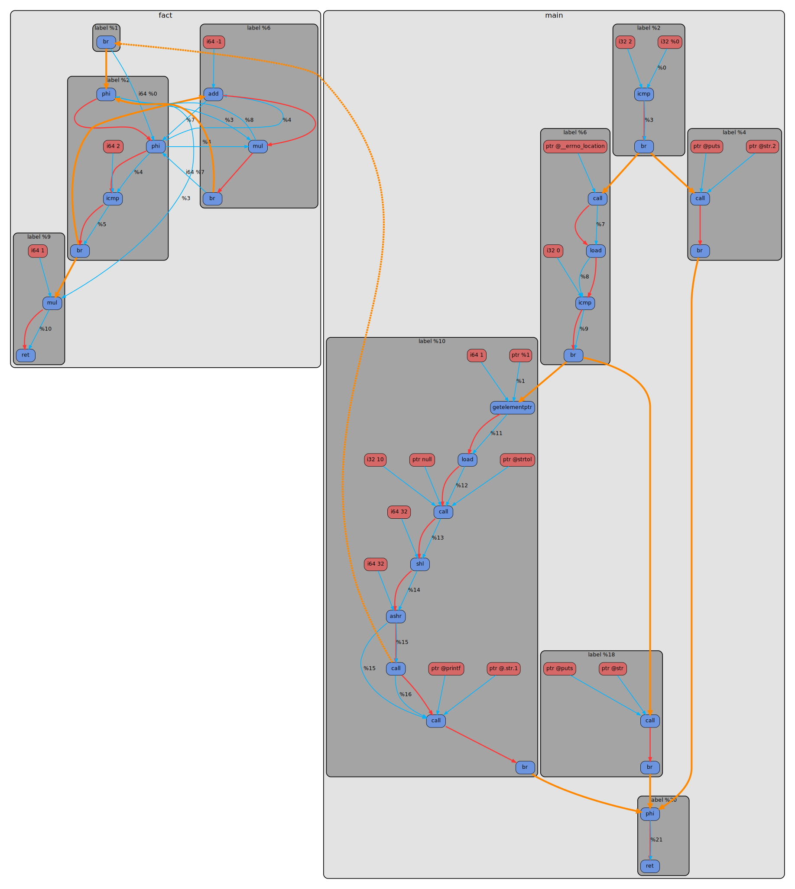
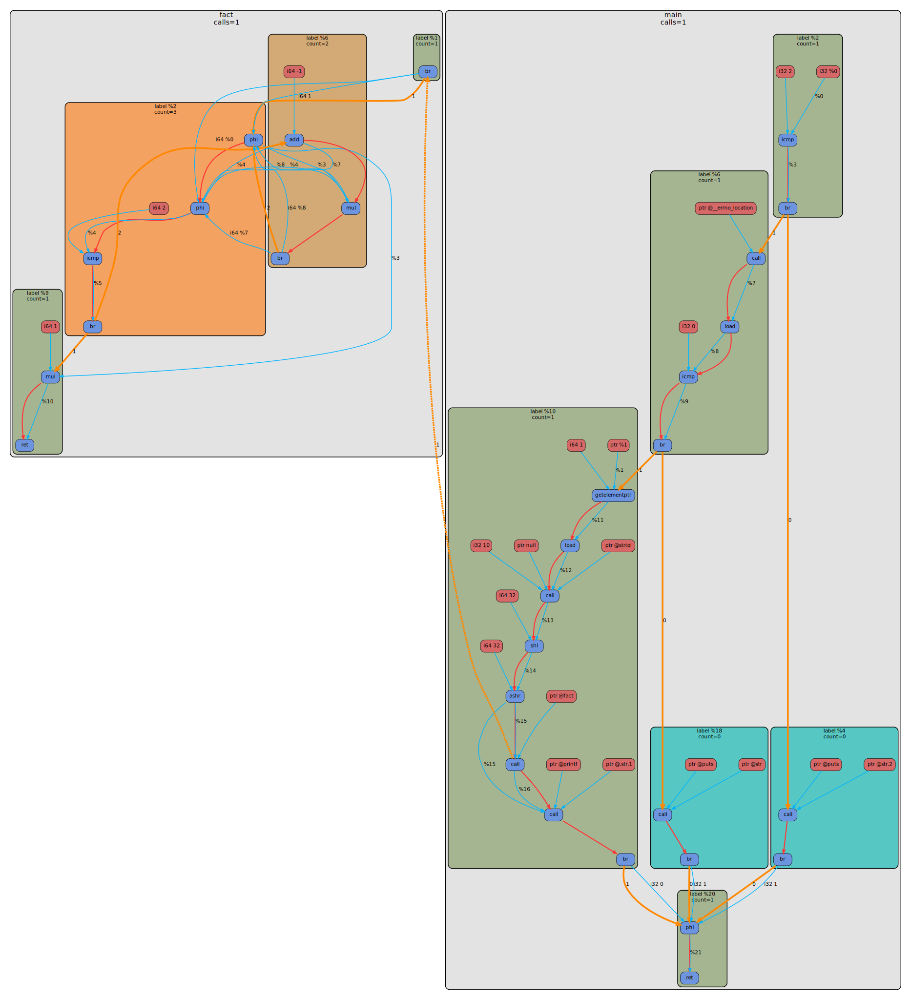

# LLVM IR Dumper

`LLVM IR Dumper` это LLVM pass plugin и набор утилит вокруг него.

Проект умеет:

- снимать два статических среза LLVM IR: `before_opt` и `after_opt`
- строить по ним промежуточное представление `IrGraph`
- сериализовать `IrGraph` в JSON
- десериализовать JSON и рендерить `.dot`
- инжектить runtime logging в бинарник
- запускать бинарник, собирать dynamic profile и мержить его обратно в JSON граф
- рисовать профилированный `.dot`, где часто посещаемые basic blocks теплее по цвету

На выходе можно получить:

- LLVM IR в `.ll`
- статический граф в `.json`
- полный граф со статикой + динамикой в `.json`
- `.dot`
- `.svg`
- обычный исполняемый файл

## Пайплайн

Статическая часть:

1. pass plugin строит `IrGraph`
2. pass сериализует его в `before_opt.json` и `after_opt.json`
3. `ir_graph_to_dot` конвертирует JSON в `.dot`
4. при необходимости `dot` из Graphviz рендерит `.svg`

Динамическая часть:

1. pass дополнительно инжектит logging в LLVM IR
2. инструментированный бинарник запускается
3. `ir_graph_profile_merge` собирает `[ir-log]` события
4. profile merge записывает `execution_count` в функции, basic blocks и `control_flow/call` edges
5. `ir_graph_to_dot` рендерит уже профилированный граф

## Архитектура

Ключевое разделение слоёв:

- `ir_graph` это чистое внутреннее представление графа, без DOT-стилей, цветов и шрифтов
- pass строит только семантический `IrGraph`
- сериализация и десериализация идут через `to_json/from_json`
- вся визуальная логика вынесена в `ir_graph_to_dot`
- dynamic profile добавляется как отдельный merge-этап поверх уже готового статического JSON

Из-за этого один и тот же JSON можно:

- анализировать отдельно
- мерджить с runtime profile
- рендерить в разные визуальные представления

## Утилиты

После сборки устанавливаются:

- `install/lib/libLLVMIRDumper.so`
- `install/bin/ir_graph_to_dot`
- `install/bin/ir_graph_profile_merge`
- `install/bin/compile_with_plugin`

Назначение:

- `libLLVMIRDumper.so` — pass plugin для `clang`
- `ir_graph_to_dot` — JSON -> DOT
- `ir_graph_profile_merge` — запуск бинаря + merge runtime profile в JSON
- `compile_with_plugin` — полный end-to-end driver на C++, аналог Python-скрипта

Python-обвязка тоже сохранена:

- `scripts/compile_with_plugin.py`

## Требования

Минимально нужны:

- `cmake`
- `clang`
- `LLVM` с установленным CMake-конфигом
- `graphviz`, если нужен SVG
- `python3`, только если вы хотите использовать Python-скрипт

Желательно, чтобы `clang` и `LLVM`, для которого собран plugin, были одной версии.

Подмодули:

- `3rd_party/argparse`
- `3rd_party/nlohmann`
- `3rd_party/dot-graph-lib`

## Сборка

```bash
bash scripts/build.sh
```

## Быстрый старт

Полный pipeline через C++ driver:

```bash
install/bin/compile_with_plugin \
  --workdir examples/fact \
  --source fact.c \
  --opt-level O1 \
  --inject-logging \
  --profile-after-run \
  --run-arg 3 \
  --no-svg
```

То же через Python:

```bash
python3 scripts/compile_with_plugin.py \
  --workdir examples/fact \
  --source fact.c \
  --opt-level O1 \
  --inject-logging \
  --profile-after-run \
  --run-arg 3 \
  --no-svg
```

После этого в `examples/fact/` появятся:

- `llvm_ir/before_opt.ll`
- `llvm_ir/after_opt.ll`
- `json/before_opt.json`
- `json/after_opt.json`
- `json/after_opt_profiled.json`
- `dot/before_opt.dot`
- `dot/after_opt.dot`
- `dot/after_opt_profiled.dot`

## Примеры визуализации

Ниже один и тот же `examples/fact/fact.c` при `-O1`.

Слева обычный `after_opt` граф без runtime profile.
Справа граф после `--profile-after-run --run-arg 5`: у basic blocks появился heat coloring, у функций `calls=N`, а у `control_flow/call` edges execution counts.

| Static `after_opt`                                            | Profiled `after_opt`                                                     |
| ------------------------------------------------------------- | ------------------------------------------------------------------------ |
|  |  |

## Типичный workflow

### 1. Только статический граф

```bash
install/bin/compile_with_plugin \
  --workdir examples/hello \
  --source hello.c \
  --opt-level O1
```

### 2. Статический граф без SVG

```bash
install/bin/compile_with_plugin \
  --workdir examples/hello \
  --source hello.c \
  --opt-level O1 \
  --no-svg
```

### 3. Статика + динамика

```bash
install/bin/compile_with_plugin \
  --workdir examples/fact \
  --source fact.c \
  --opt-level O1 \
  --profile-after-run \
  --run-arg 3
```

`--profile-after-run` автоматически включает logging injection на этапе компиляции.

Если программа требует аргументы командной строки, их надо передавать через повторяющийся `--run-arg`.

Пример:

```bash
install/bin/compile_with_plugin \
  --workdir examples/fact \
  --source fact.c \
  --profile-after-run \
  --run-arg 3 \
  --run-arg extra_value
```

## Основные аргументы `compile_with_plugin`

- `--source` путь к исходному файлу
- `--workdir` базовая директория для всех относительных путей
- `--plugin-path` путь к `libLLVMIRDumper.so`
- `--converter-path` путь к `ir_graph_to_dot`
- `--profile-tool-path` путь к `ir_graph_profile_merge`
- `--opt-level` уровень оптимизации, например `O1`, `O2`, `O3`
- `--binary-out` путь к итоговому бинарнику
- `--inject-logging` вставить runtime logging в IR
- `--profile-after-run` запустить бинарник и смержить dynamic profile
- `--run-arg ARG` аргумент для запуска профилируемого бинарника
- `--extra-clang-arg ARG` дополнительный аргумент для `clang`
- `--no-svg` не вызывать Graphviz

Артефакты:

- `--before-ll`, `--after-ll`
- `--before-json`, `--after-json`, `--profile-json`
- `--before-dot`, `--after-dot`, `--profile-dot`
- `--before-svg`, `--after-svg`, `--profile-svg`

## Отдельные утилиты

### JSON -> DOT

```bash
install/bin/ir_graph_to_dot \
  --input-json examples/fact/json/after_opt.json \
  --output-dot examples/fact/dot/after_opt.dot
```

### Merge runtime profile

```bash
install/bin/ir_graph_profile_merge \
  --input-json examples/fact/json/after_opt.json \
  --binary build/a.out \
  --output-json examples/fact/json/after_opt_profiled.json \
  --binary-arg 3
```

`ir_graph_profile_merge`:

- запускает бинарник
- фильтрует `[ir-log]` события
- считает execution counts
- пишет merged JSON

## Dynamic profile в DOT

После merge-а профилированный DOT содержит:

- `calls=N` у function clusters
- `count=N` у basic block clusters
- execution count на `control_flow` edges
- execution count на `call` edges

Цвет basic block зависит от частоты посещения:

- холодные блоки — ближе к бирюзовому
- горячие блоки — ближе к оранжевому

## Ограничения

- если программа при profiling run завершается с ошибкой, merge-этап тоже завершится ошибкой
- если программа ожидает `argv`, их надо явно передавать через `--run-arg`
- dynamic profile сейчас аннотирует:
  - функции
  - basic blocks
  - `control_flow` edges
  - `call` edges
- остальные рёбра (`data_flow`, `instruction_sequence`) остаются только статическими
