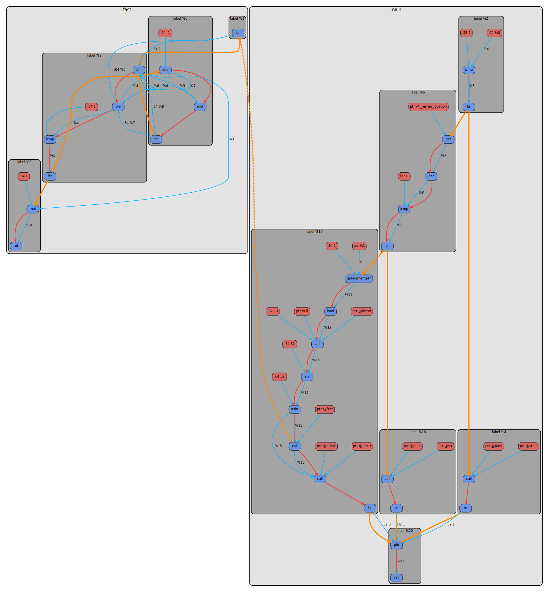
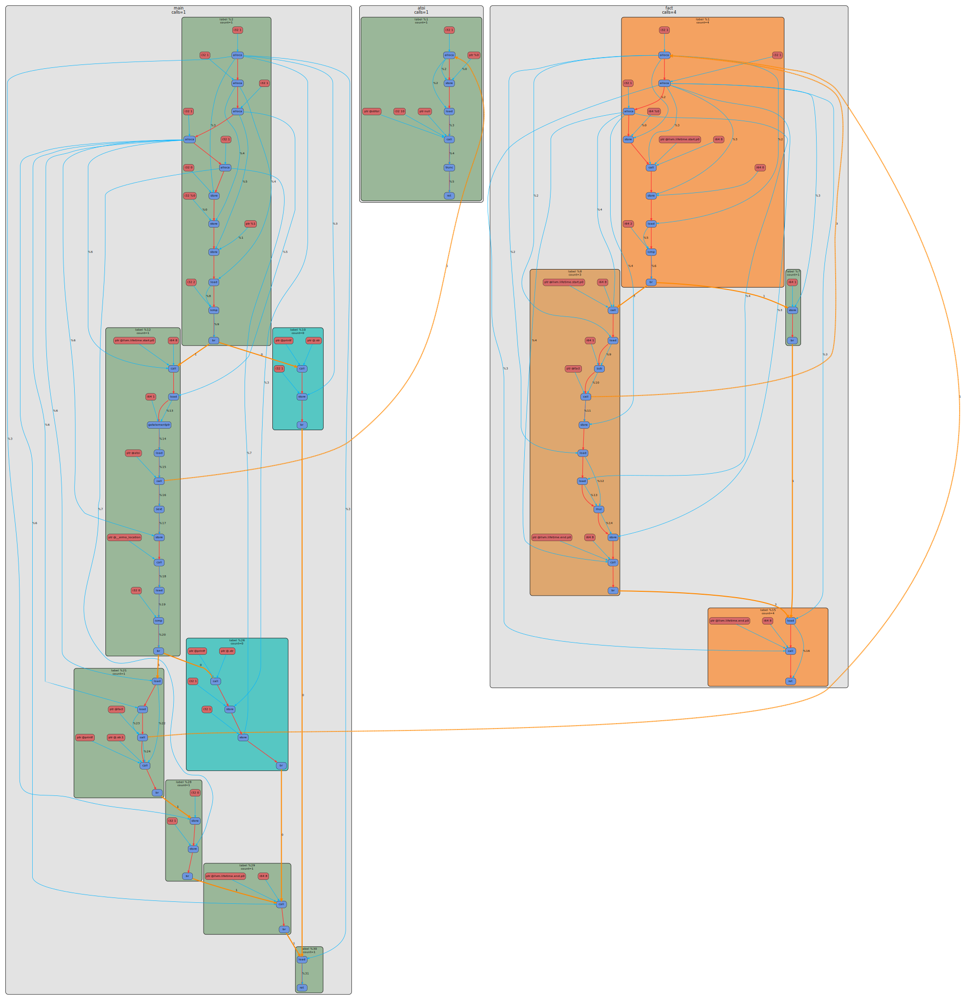
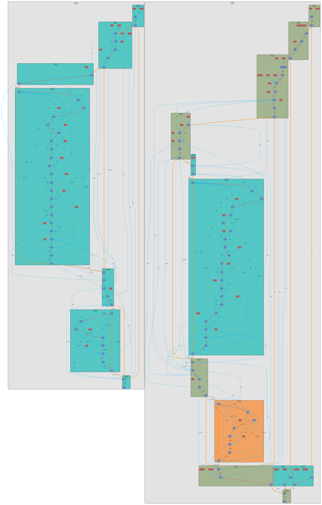

# Control and Data Flow Graph Generator (cdfgg)

## Содержание

<div class="toc">
  <div class="toc-item">1. <a href="#установка-и-запуск">Установка и запуск</a></div>
  <div class="toc-item">2. <a href="#интерфейс-драйвера">Интерфейс драйвера</a></div>
  <div class="toc-item">3. <a href="#архитектура-проекта">Архитектура проекта</a></div>
  <div class="toc-item">4. <a href="#формат-ir-graph-json">Формат IR Graph JSON</a></div>
  <div class="toc-item">5. <a href="#формат-runtime-profile">Формат runtime profile</a></div>
  <div class="toc-item">6. <a href="#визуализация-графа">Визуализация графа</a></div>
  <div class="toc-item">7. <a href="#сравнение-статического-и-динамического-графа">Сравнение статического и динамического графа</a></div>
  <div class="toc-item">8. <a href="#сравнение-графов-до-оптимизаций-и-после">Сравнение графов до оптимизаций и после</a></div>
</div><br>

**`cdfgg`** это утилита для генерации статических и динамических CFG/DFG-графов программы из её исходного кода. Проект встраивает LLVM pass plugin в `clang`, сохраняет IR до и после оптимизаций, при необходимости добавляет runtime-инструментацию, а затем превращает результат в сериализуемый `ir_graph` JSON, `dot` и `svg`.

## Установка и запуск

Сборка выполняется из директории проекта:

```bash
git submodule update --init --recursive
cmake -B build
cmake --build build
cmake --install build --prefix install
```

Есть возможность задать симлинк для искомого драйвера:

```bash
cmake -B build -DGRAPHCC_INSTALL_SYMLINK=ON -DGRAPHCC_INSTALL_SYMLINK_DIR=path2symlink
```

Минимальные зависимости:

- `cmake`
- `python3`
- `clang`
- `llvm`
- `graphviz` для генерации `svg`

Быстрый запуск для получения финального динамического графа:

```bash
install/bin/cdfgg examples/fact/fact.c --program-arg 5 -o examples/fact/dynamic.svg
```

Полный дамп всех промежуточных стадий:

```bash
install/bin/cdfgg examples/fact/fact.c \
  --workdir examples/fact \
  --program-arg 5 \
  --full
```

Если нужен полный дамп сразу для нескольких уровней оптимизации:

```bash
install/bin/cdfgg examples/fact/fact.c \
  --workdir examples/fact \
  -O1 -O2 -O3 \
  --program-arg 5 \
  --full \
  --delete-bins
```

В этом режиме внутри `workdir` появятся подкаталоги `O1`, `O2`, `O3`, и в каждом из них будет свой набор артефактов.

## Интерфейс драйвера

`cdfgg` ведёт себя как компиляторный driver: на вход подаётся исходный `.c/.cpp` файл, а на выходе получается либо конечный `svg`, либо набор промежуточных представлений через `--emit-*`.

| Флаг                                               | Назначение                                                           |
| :------------------------------------------------- | :------------------------------------------------------------------- |
| `source`                                           | входной `.c` или `.cpp` файл, позиционный аргумент                   |
| `-o path.svg`                                      | финальный `after` dynamic SVG                                        |
| `-O1`, `-O2`, `-O3`, `-Og`, `-Os`, `-Oz`, `-Ofast` | уровень оптимизации                                                  |
| `--emit-static-graph [DIR]`                        | сохранить static SVG                                                 |
| `--emit-dynamic-graph [DIR]`                       | сохранить dynamic SVG                                                |
| `--emit-json [DIR]`                                | сохранить `ir_graph` JSON                                            |
| `--emit-dot [DIR]`                                 | сохранить `dot`                                                      |
| `--emit-ll [DIR]`                                  | сохранить `before_opt.ll` и `after_opt.ll`                           |
| `--emit-profile [DIR]`                             | сохранить сырой runtime profile                                      |
| `--static-stage before\|after\|both`               | какие static стадии нужны                                            |
| `--dynamic-stage before\|after\|both`              | какие dynamic стадии нужны                                           |
| `--program-arg ARG`                                | передать один аргумент запускаемой инструментированной программе     |
| `--program-args ...`                               | передать все оставшиеся аргументы  инструментированной программе     |
| `--full`                                           | сохранить все основные артефакты для `before/after` static и dynamic |
| `--delete-bins`                                    | удалить `bin/out` из конечного `workdir` после успешного запуска     |
| `--keep-tmp`                                       | не удалять `tmp` после успеха                                        |
| `--debug`                                          | не чистить артефакты после ошибки                                    |
| `--verbose`                                        | печатать все запускаемые команды                                     |

Типичный вид `workdir` при `--full` выглядит так:

```txt
workdir/
├── bin/
├── json/
├── dot/
├── llvm_ir/
├── profile/
├── svg/
└── tmp/ # при --keep-tmp
```

Все артефакты сначала создаются во временной директории `tmp`, а потом, если пользователь запросил соответствующий `--emit-*`, копируются в итоговые директории.

## Архитектура проекта

Проект разбит на четыре слоя:

### 1. LLVM pass plugin

Плагин встраивается в `clang` и работает в двух режимах:

- **static mode**: строит `ir_graph` для `before` и/или `after` optimization;
- **dynamic mode**: вставляет в IR логирующую логику, которая пишет события исполнения базовых блоков, функций и CFG/call edges.

### 2. `ir_graph`

`ir_graph` это независимое промежуточное представление графа программы. Оно не знает ничего про `dot` и хранит только семантические сущности:

- `functions`
- `basic_blocks`
- `nodes`
- `edges`

У всех сущностей есть собственные целочисленные `id`, поэтому JSON не зависит от LLVM-указателей и пригоден для последующего merge и анализа.

### 3. Merge runtime profile

Когда нужен dynamic граф, инструментированный бинарник сначала запускается на данных пользователя, пишет runtime log, а затем утилита `ir_graph_merge_with_profile` объединяет этот лог со static JSON.

### 4. Рендеринг

После merge утилита `ir_graph_to_dot` превращает JSON в `dot`, а Graphviz строит итоговый `svg`.

<div align="center">
    <br>
    
    <br>
    <strong>Архитектура cdfgg</strong><br><br>
</div>

## Формат IR Graph JSON

`ir_graph` JSON является главным артефактом проекта. Именно он считается каноническим представлением графа, а не `dot`.

Верхнеуровневая структура:

```json
{
  "module_name": "examples/fact/fact.c",
  "functions": [...],
  "basic_blocks": [...],
  "nodes": [...],
  "edges": [...]
}
```

### `functions`

Каждая функция хранит:

- `id` — глобальный идентификатор функции в snapshot;
- `name` — имя функции;
- `entry_basic_block_id` — входной basic block;
- `entry_node_id` — первая instruction-node функции;
- `execution_count` — число вызовов функции для dynamic graph.

### `basic_blocks`

Каждый блок хранит:

- `id` — идентификатор блока;
- `function_id` — владелец-функция;
- `label` — текстовый label блока;
- `entry_node_id` — первая instruction-node блока;
- `execution_count` — число входов в блок.

### `nodes`

`nodes` это реальные вершины графа. Сейчас в JSON встречаются как минимум:

- `instruction` — инструкция LLVM;
- `operand` — отдельный operand/use-узел.

У узла хранятся:

- `id`
- `kind`
- `function_id`
- `basic_block_id`
- `label`
- `opcode_name`
- `consumer_instruction_id`
- `operand_index`

Пример:

```json
{
  "id": 46,
  "kind": "instruction",
  "function_id": 1,
  "basic_block_id": 7,
  "label": "icmp",
  "opcode_name": "icmp",
  "consumer_instruction_id": null,
  "operand_index": null
}
```

### `edges`

`edges` задают типизированные связи между вершинами графа:

- `instruction_sequence`
- `data_flow`
- `control_flow`
- `call`

Для каждого ребра доступны:

- `id`
- `kind`
- `source_node_id`
- `target_node_id`
- `source_basic_block_id`
- `target_basic_block_id`
- `source_function_id`
- `target_function_id`
- `successor_index`
- `label`
- `execution_count`

`execution_count` заполняется только для тех рёбер, для которых есть динамический смысл, в первую очередь для `control_flow` и `call`.

## Формат runtime profile

Во время dynamic-инструментации в бинарник вставляются логирующие вызовы. На выходе получается не сразу merged JSON, а сырой runtime log:

```txt
[ir-log] func_enter fid=1
[ir-log] bb_enter fid=1 bbid=7
[ir-log] cfg_edge eid=103 fid=1 src_bbid=7 dst_bbid=9 succ=0
[ir-log] bb_enter fid=1 bbid=9
[ir-log] cfg_edge eid=104 fid=1 src_bbid=9 dst_bbid=10 succ=0
```

Лог содержит четыре основных типа событий:

- `func_enter`
- `bb_enter`
- `cfg_edge`
- `call_edge`

Далее утилита `ir_graph_merge_with_profile` парсит эти записи и переносит счётчики в поля `execution_count` соответствующих функций, basic blocks и рёбер внутри `ir_graph` JSON.

Таким образом:

- **static JSON** содержит статическую структуру графа;
- **runtime log** содержит динамическую информацию об исполнении;
- **dynamic JSON** содержит уже объединённую картину.

## Визуализация графа

Визуальная модель графа сохраняет разделение между control-flow и data-flow:

- синяя вершина — instruction-node;
- красная вершина — operand/use-node;
- светло-серый кластер — функция;
- тёмно-серый кластер — basic block;
- голубое ребро — data flow;
- красное ребро — instruction sequence;
- оранжевое ребро — control flow;
- оранжевое пунктирное ребро — call edge.

Для dynamic-графов дополнительно включается heat coloring:

- холодные basic blocks окрашиваются в бирюзовые оттенки;
- часто исполняемые basic blocks становятся теплее, вплоть до оранжевого;
- на CFG и call edges появляются подписи с `execution_count`.

Пример соответсвующих графов для <a href="docs/before_after_cmp/fact.c">fact.c</a>:

<div align="center">
    <br>
    
    <br>
    <strong>Статический граф после оптимизаций</strong><br><br>
</div>

<div align="center">
    <br>
    
    <br>
    <strong>Динамический граф после мерджа со runtime profile</strong><br><br>
</div>

## Сравнение статического и динамического графа

Статический граф показывает только структуру программы:

- какие функции и basic blocks существуют;
- как между ними проходят CFG-рёбра;
- как устроен data-flow между LLVM-инструкциями и operand-узлами.

Динамический граф добавляет к этой структуре данные реального исполнения:

- сколько раз была вызвана функция;
- сколько раз вошли в каждый basic block;
- сколько раз прошли по каждому CFG/call edge.
- какие участки графа были горячими, а какие вообще не исполнялись.

## Сравнение графов до оптимизаций и после

С помощью `cdfgg` можно также наглядно наблюдать какие оптимизации делают llvm pass'ы при различных уровнях оптимизаций. Пример соответсвующих графов для <a href="docs/before_after_cmp/fact.c">fact.c</a>:

<div align="center">
    <br>
    
    <br>
    <strong>Before optimization</strong><br><br>
</div>

<div align="center">
    <br>
    
    <br>
    <strong>After optimization -O1</strong><br><br>
</div>

<div align="center">
    <br>
    
    <br>
    <strong>After optimization -O2</strong><br><br>
</div>

## P.S.

Проект является учебным. Выполнен студентом 2 курса ФРКТ МФТИ в рамках курса по LLVM от [Сергея Лисицына](https://github.com/lisitsynSA)
